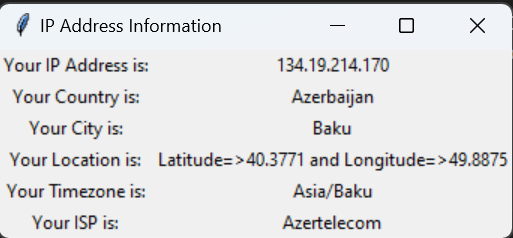

# Hi, I'm Dr4ks! 👋

## 🚀 About Me
I'm a Cyber Security student.

## 🔗 Links
[](https://www.linkedin.com/in/sahib-humbatzada-42b082223/)
[](https://www.hackerrank.com/Dr4ks)
[](https://tryhackme.com/p/Dr4ks)
[](https://github.com/Dr4ks)


## 🛠 Skills
Python

## Usage
1. Switch to directory
```bash
cd IP_Enum
```

2. Run the script
```bash 
python3 script.py
```

**Note**: You need to have "requests" and "tkinter" package installed in order to run the script. If you don't have it, you can install it by running the following command:
```bash
pip3 install requests
```

*Example Image*:
<br />


## Authors
- [@dr4ks](https://www.github.com/Dr4ks)